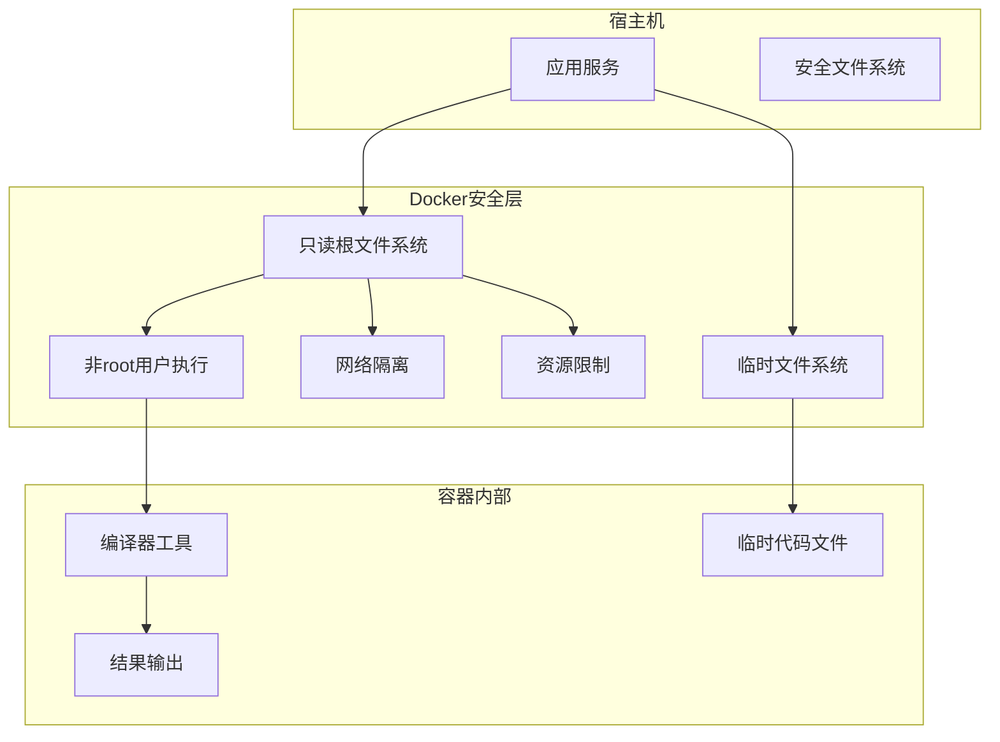

# 编译器工具官方镜像集成 - 架构设计文档

## 1. 架构概述

### 1.1 架构目标

* **标准化环境**: 通过官方Docker镜像提供标准化的编译环境，消除本地环境差异
* **可扩展性**: 支持轻松添加新的编程语言支持，只需更新Docker镜像映射
* **高可用性**: 确保编译服务的稳定性和容错能力，即使个别容器失败也不影响整体服务
* **可维护性**: 简化编译器环境的管理和更新，降低维护成本

### 1.2 架构原则

* **单一职责原则**: 每个容器专门负责一种编程语言的编译检查
* **资源隔离**: 通过Docker容器级别隔离确保安全性和资源限制
* **无状态设计**: 编译容器不保存状态，每次执行都是独立的
* **快速响应**: 优化容器启动和执行流程，减少响应时间
* **安全性优先**: 确保文件系统交互和容器执行的安全性

## 2. 系统架构

### 2.1 整体架构图


### 2.2 架构分层

#### 2.2.1 客户端层
* API客户端: 提供RESTful API接口供外部系统调用
* Web界面: 提供用户友好的Web界面进行代码提交和结果查看

#### 2.2.2 应用服务层
* Docker编译器管理器: 核心组件，负责协调编译任务的执行
* 容器池管理器: 管理编译容器的生命周期，包括创建、复用和销毁
* 文件系统管理器: 安全处理宿主机与容器之间的文件传输
* 资源监控器: 监控容器资源使用情况，实施资源限制

#### 2.2.3 Docker容器层
包含各种编程语言的官方Docker镜像实例，每种语言一个专用容器

#### 2.2.4 基础设施层
* Docker引擎: 提供容器运行环境
* 文件系统: 提供临时文件存储空间
* 资源监控数据: 收集和分析资源使用情况

## 3. 服务设计

### 3.1 核心组件

| 组件名称 | 职责 | 关键技术 |
|----------|------|----------|
| Docker编译器管理器 | 协调编译任务，选择合适的语言容器 | Docker SDK, 异步任务队列 |
| 容器池管理器 | 管理容器生命周期，实现容器复用 | Docker容器API, 连接池模式 |
| 文件系统管理器 | 安全处理文件传输和权限映射 | 临时文件系统, 权限控制 |
| 资源监控器 | 监控资源使用，实施限制策略 | cgroups, Docker统计API |

### 3.2 Docker镜像映射

| 语言 | 官方镜像 | 编译命令 | 资源限制 |
|------|----------|----------|----------|
| Python | python:3.11-slim | python -m py_compile | 内存256MB, CPU 0.5 |
| JavaScript | node:18-alpine | node --check | 内存256MB, CPU 0.5 |
| TypeScript | node:18-alpine | npx tsc --noEmit | 内存384MB, CPU 0.5 |
| Java | openjdk:17-slim | javac | 内存512MB, CPU 1.0 |
| C | gcc:latest | gcc -fsyntax-only | 内存256MB, CPU 0.5 |
| C++ | gcc:latest | g++ -fsyntax-only | 内存256MB, CPU 0.5 |
| Go | golang:1.21-alpine | go tool compile | 内存256MB, CPU 0.5 |
| Rust | rust:1.75-slim | rustc --emit=metadata | 内存512MB, CPU 1.0 |
| PHP | php:8.2-cli | php -l | 内存256MB, CPU 0.5 |
| Ruby | ruby:3.2-slim | ruby -c | 内存256MB, CPU 0.5 |

### 3.3 API设计

#### 3.3.1 编译检查API

* **URL**: `/api/v1/compile/check`

* **Method**: POST
* **描述**: 执行代码编译检查
* **请求参数**:

  ```json
  {
    "language": "python",
    "files": [
      {
        "path": "example.py",
        "content": "print('Hello, world!')"
      }
    ],
    "options": {
      "timeout": 30,
      "include_heuristics": true
    }
  }
  ```

* **响应格式**:

  ```json
  {
    "code": 200,
    "data": {
      "compilable": true,
      "errors": [],
      "execution_time": 1.23,
      "container_id": "abc123"
    },
    "message": "成功"
  }
  ```

## 4. 容器安全隔离机制

### 4.1 安全隔离策略



### 4.2 安全实施细节

* **只读根文件系统**: 容器根文件系统挂载为只读，防止恶意篡改
* **临时文件系统**: 使用tmpfs存储临时文件，确保数据不持久化
* **非root用户执行**: 容器内使用非特权用户运行编译命令
* **网络隔离**: 禁用网络访问，防止容器内代码访问外部资源
* **资源限制**: 通过cgroups限制CPU、内存使用，防止资源耗尽
* **文件系统权限**: 严格控制容器内文件访问权限，只允许访问必要目录

## 5. 资源使用限制和监控

### 5.1 资源限制策略

| 资源类型 | 限制方式 | 默认值 | 监控指标 |
|----------|----------|--------|----------|
| CPU | cgroups CPU配额 | 0.5核心 | CPU使用率 |
| 内存 | cgroups内存限制 | 256-512MB | 内存使用量 |
| 磁盘 | 临时文件系统大小 | 100MB | 磁盘使用量 |
| 执行时间 | 超时终止 | 30秒 | 执行时长 |
| 并发容器 | 容器池大小限制 | 10个 | 活跃容器数 |

### 5.2 监控机制

* 监控容器资源使用情况
* 实施资源限制策略
* 超时处理机制

### 5.3 资源调整策略

* 根据不同语言类型分配资源
* 基于编译需求调整资源限制
* 考虑系统负载情况动态分配资源

## 6. 容器生命周期管理

### 6.1 容器生命周期流程


### 6.2 容器池管理策略

* **预热容器**: 保持少量常用语言容器预热状态，减少启动延迟
* **容器复用**: 短时间内相同语言的请求可以复用容器
* **懒加载**: 非常用语言容器按需创建
* **定期清理**: 定期清理长时间未使用的容器
* **健康检查**: 定期检查容器状态，移除异常容器

## 7. 文件系统安全交互

### 7.1 文件交互架构


### 7.2 安全文件传输流程

1. **输入文件处理**:
   * 将用户代码写入宿主机安全暂存区
   * 设置文件权限为只读
   * 通过只读卷挂载到容器

2. **输出文件收集**:
   * 容器内结果写入临时输出卷
   * 宿主机进程从临时卷收集结果
   * 清理临时文件和挂载点

3. **权限控制**:
   * 严格控制文件访问权限
   * 使用临时文件系统避免持久化
   * 禁止容器访问宿主机敏感目录

## 8. 错误处理和恢复机制

### 8.1 错误分类和处理策略

| 错误类型 | 处理策略 | 恢复机制 |
|----------|----------|----------|
| 容器启动失败 | 记录错误，尝试备用镜像 | 重新拉取镜像，检查Docker状态 |
| 编译超时 | 强制终止容器，返回超时错误 | 增加超时阈值，优化容器资源 |
| 资源不足 | 拒绝请求，返回资源不足错误 | 等待资源释放，扩展容器池 |
| 镜像拉取失败 | 使用本地缓存镜像，返回降级服务 | 后台重试拉取，通知管理员 |
| 文件系统错误 | 清理临时文件，重试操作 | 检查磁盘空间，修复权限 |

### 8.2 恢复机制


### 8.3 服务降级策略

* **优雅降级**: 当Docker服务不可用时，回退到原有的启发式检查
* **部分功能降级**: 当特定语言镜像不可用时，禁用该语言检查
* **性能降级**: 资源紧张时降低并发度，延长响应时间
* **快速失败**: 检测到不可恢复错误时立即返回，避免资源浪费

## 9. 现有系统集成策略

### 9.1 兼容性保证

* **API兼容**: 保持现有MCPClient接口不变
* **响应格式**: 维持原有响应结构
* **错误处理**: 保持原有错误类型和格式
* **性能指标**: 确保响应时间不超过原有系统的150%

### 9.2 迁移策略

1. **渐进式替换**: 逐个语言从本地编译器迁移到Docker容器
2. **双模式运行**: 支持本地和Docker模式并存，通过配置切换
3. **A/B测试**: 部分请求使用新系统，对比结果质量
4. **回滚机制**: 必要时快速回滚到原有实现

### 9.3 配置管理

```yaml
# 示例配置文件
compiler:
  mode: "docker"  # docker, local, hybrid
  docker:
    image_registry: "docker.io"
    pull_policy: "if_not_present"  # always, if_not_present, never
    container_pool:
      max_size: 10
      prewarm_languages: ["python", "javascript", "java"]
      idle_timeout: 300  # 秒
    resources:
      default:
        memory: "256m"
        cpu: "0.5"
        timeout: 30
      java:
        memory: "512m"
        cpu: "1.0"
        timeout: 60
    security:
      read_only_rootfs: true
      no_network: true
      drop_capabilities: true
```

## 10. 总结

本架构设计提供了一种安全、可扩展、高性能的Docker官方镜像集成方案，用于替换现有的本地编译器工具。通过容器化技术，我们能够：

1. **标准化编译环境**: 确保所有编译检查在一致的环境中执行
2. **提高系统安全性**: 通过多层隔离和资源限制增强安全性
3. **简化运维管理**: 集中管理编译器环境，降低维护成本
4. **保持系统兼容**: 确保与现有系统无缝集成，不破坏现有功能

该设计方案充分考虑了安全性、资源管理、容器生命周期和错误处理等关键方面，为实施提供了清晰的指导。