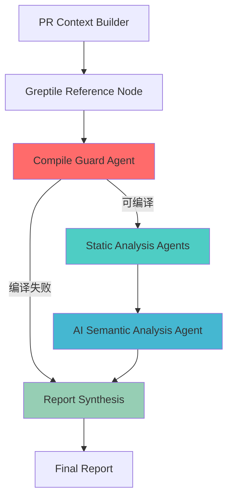

# 🚀 多层智能Agent代码审查系统
一个基于**多层协同Agent架构**的高级AI代码审查平台，通过五层智能代理的精确协作，实现对GitHub Pull Request的全方位、多维度代码质量分析。
---
## ✨ 核心架构：五层智能Agent协同系统
本系统采用独特的**五层Agent架构**，从底层静态检查到高层语义分析，层层递进，确保代码审查的**全面性、准确性和可执行性**。

### 🧱 第一层：上下文构建Agent (Context Builder)
**职责**：智能收集PR的完整上下文信息
- 自动识别编程语言（Python/JavaScript/Java/C++等）
- 高效获取PR的diff内容
- 延迟加载文件内容（仅在通过编译守卫后加载，减少不必要开销）
- 支持增量式文件获取，避免大规模IO阻塞
**技术亮点**：
```python
async def pr_context_builder(state: ReviewState):
    diff = await github_client.fetch_diff(repo, pr_number)
    files = await github_client.fetch_pr_files_meta(repo, pr_number)
    lang = detect_language(changed_files)  # 智能语言检测
```
---
### 🔗 第二层：Greptile专家Agent (External Expert)
**职责**：集成行业领先的代码审查引擎作为外部强参考
- 通过**MCP协议**（Model Context Protocol）集成Greptile
- 双数据源策略：
  - 优先使用Greptile官方MCP API获取结构化审查结果
  - 降级解析PR中的Greptile机器人评论
- 智能提取编译阻断信号
- 结构化转换为标准Finding格式
**核心优势**：
- **权威参考**：借助Greptile的代码库深度理解能力
- **双向验证**：Greptile结果与LLM判断相互印证
- **快速路径**：已存在的Greptile审查结果可立即复用，避免重复分析
```python
async def greptile_reference_node(state):
    # 优先MCP集成
    if settings.greptile_api_key:
        body, comments = await greptile_client.get_pr_review_bundle(...)
    # 降级：从PR评论提取
    else:
        text = await github_client.fetch_greptile_reference_text(...)
```
---
### 🛡️ 第三层：编译守卫Agent (Compile Guard)
**职责**：作为"万能编译器"，在深度分析前阻断编译级错误
**设计理念**：
> "不能编译的代码无需进行深层语义分析——先修好编译错误"
**智能策略**：
1. **优先级路由**：
   - DeepSeek模型优先用于编译级错误检查（更强的逻辑推理能力）
   - GLM模型用于其他语义分析任务
2. **Greptile交叉验证机制**：
   - 如果LLM判断"不可编译"，必须得到Greptile的确认才真正阻断
   - 防止LLM的误报导致的过度审查
   - 减少开发者不必要的干扰
3. **早退出设计**（Early Exit）：
   - 一旦确认编译失败，立即生成详细修复建议并返回
   - 节省后续AI分析的计算资源和时间成本
```python
def compile_guard_node(state):
    # DeepSeek优先用于编译检查
    content = _llm_invoke_with_retry(llm_deepseek, prompt)
    
    # Greptile强参考约束
    if compilable is False and not state.get('greptile_compile_block'):
        compilable = True  # 无Greptile确认，不阻断
    
    # 编译失败 -> 早退出
    if not compilable:
        return generate_compile_error_report()
```
**支持的错误类型**：
- `SyntaxError` - 语法错误
- `TypeError` - 类型错误
- `CompileError` - 编译错误
- `MissingDependency` - 缺失依赖
---
### 🔍 第四层：静态分析Agent层 (Static Analysis Agents)
**职责**：使用确定性规则和AST分析发现可100%复现的缺陷
**多Agent并行分析**：
1. **Python静态缺陷扫描**
   - 文件句柄资源泄漏检测
   - 未初始化变量使用检测
   - 判断条件永远为True/False检测
   - 死代码检测（return/raise后的不可达代码）
2. **跨语言死循环检测**
   - 支持Python、C/C++、Go、Rust等语言
   - 基于AST和正则规则的高精度检测
   - 智能检测`while True`、`for(;;)`、`for {}`、`loop {}`等模式
3. **除以零检测**
   - 字面量除以零的编译期检测
   - 支持Python AST和C++模式匹配
4. **MCP工具集成**（可扩展）
   - 编译检查端点
   - 静态分析端点
   - 依赖分析端点
   - 安全检查端点
**技术实现**：
```python
class _PyDefectVisitor(ast.NodeVisitor):
    def visit_BinOp(self, node):
        # 除以零检测
        if isinstance(node.op, ast.Div) and isinstance(node.right, ast.Constant):
            if node.right.value == 0:
                defects.append({"type": "DivideByZero", "confidence": "high"})
def _detect_infinite_loop_in_patch(patch):
    # 跨语言死循环检测
    loop_patterns = [
        r"\bwhile\s*\(\s*true\s*\)\s*\{",
        r"\bfor\s*\(\s*;\s*;\s*\)\s*\{",
        r"^\s*for\s*\{\s*$",  # Go
        r"^\s*loop\s*\{\s*$",  # Rust
    ]
```
**置信度分级**：
- **High** - 100%确定的问题（如字面量除以零）
- **Medium** - 高概率问题（如可能的资源泄漏）
---
### 🧠 第五层：AI语义分析Agent (Semantic Analysis Agent)
**职责**：进行深层次的语义理解和潜在风险挖掘
**分析维度**：
1. **语义级Bug检测**
   - 边界条件错误
   - 逻辑漏洞
   - 并发安全问题
2. **性能与可维护性分析**
   - 性能瓶颈识别
   - 代码坏味道（Code Smell）检测
   - 可维护性评分
3. **架构与依赖分析**
   - 架构层次违规（如API直接依赖DB层）
   - 循环依赖检测
   - 未使用的导入/变量
4. **安全信号检测**
   - SQL注入风险
   - XSS漏洞
   - 敏感信息泄露
**双模型策略**：
- **GLM-4.6** - 用于通用语义分析和报告生成
- **深度定制Prompt** - 确保输出结构化和可执行
```python
async def ai_review_node(state):
    # GLM用于语义分析
    findings = _llm_invoke_with_retry(
        llm_glm, 
        semantic_analysis_prompt
    )
    # 结构化输出
    return parse_ai_findings(findings)
```
---
### 🎭 第六层：报告合成Agent (Report Synthesis)
**职责**：将各层Agent的分析结果整合成可执行的中文报告
**智能合成逻辑**：
1. **编译级别报告**（优先级最高）
   - 精确的文件和行号定位
   - 代码片段高亮展示
   - 自动生成修复建议
2. **静态缺陷报告**
   - 分类展示（资源泄漏、死循环、除以零等）
   - 置信度标注
   - 修复代码示例
3. **AI风险报告**
   - 严重性分级（critical/high/medium/low）
   - 分类标签（Bug/Performance/Security/Architecture）
   - 中英文对照（保留技术准确性，确保可读性）
4. **Greptile集成报告**
   - 外部专家意见整合
   - 证据链追溯
**报告示例**：
```markdown
# PR 审查报告
## [BLOCKER] Compile / Parse Errors
- backend/app/main.py:12 SyntaxError: 缺少括号
## [BLOCKER] Static Defects
- backend/app/service.py:44 [ResourceLeak] 文件句柄未关闭
## Potential Risks（AI 推理）
- [high] backend/app/api.py:82 返回值未检查，可能导致空指针异常
## [ARCH] Architecture Issues
- LayerViolation: API层直接依赖DB包
```
---
## 🎯 多层Agent架构的核心优势
### 1. 🎭 **分层处理策略**
每层Agent专注于特定能力边界，避免"一刀切"的单模型分析：
- **第一层**（确定性）：100%准确率的静态规则
- **第二层**（外部专家）：Greptile的深度代码库理解
- **第三层**（编译守卫）：精确的编译错误拦截，避免浪费
- **第四层**（静态分析）：AST级别的精确检测
- **第五层**（语义分析）：深层次理解和推理
- **第六层**（合成）：智能整合，统一输出
### 2. ⚡ **早退出机制**
**关键优化**：编译守卫Agent的早退出设计
- 立即在可发现的问题前停止
- 避免在明显错误的代码上进行昂贵的语义分析
- 典型耗时对比：
  - 编译失败场景：**~2秒**（仅编译守卫）
  - 无编译错误：**~8-15秒**（完整流程）
### 3. 🤝 **交叉验证机制**
- **LLM判断 + Greptile确认** = 更高的准确性
- 降低LLM幻觉导致的误报
- 提升开发者对AI审查的信任度
### 4. 🛠️ **可扩展的MCP生态**
通过MCP协议集成专业工具：
- Greptile（代码库深度理解）
- 编译器/类型检查器
- 静态分析工具
- 安全扫描器
**扩展示例**：
```python
# 添加新的MCP工具
mcp_security_endpoint = "https://security-tool.example.com/mcp"
```
### 5. 🧮 **多模型智能路由**
- **DeepSeek** → 编译/类型检查（逻辑推理强）
- **GLM-4.6** → 语义分析（理解力强）
- 根据任务类型自动选择最优模型
### 6. 🎨 **统一结构化输出**
所有Agent输出统一转换为Finding格式：
```json
{
  "file": "backend/app/main.py",
  "line": 42,
  "level": "high",
  "category": "Bug",
  "title": "潜在空指针异常",
  "detail": "返回值未检查",
  "suggestion": "添加None检查并抛出显式错误"
}
```
---
## 📋 系统特性
### 智能路由策略
```python
# 编译守卫 → 优先DeepSeek
llm_deepseek = ChatOpenAI(model="deepseek-chat")
# 语义分析 → 优先GLM
llm_glm = ChatOpenAI(model="glm-4.6")
```
### 容错设计
- **Greptile失败** → 降级到PR评论解析
- **LLM调用失败** → 使用确定性静态分析继续
- **MCP工具不可用** → 使用本地降级规则
- 任何单点失败都不影响整体流程
### 性能优化
- **智能缓存**：避免重复的文件内容获取
- **并发控制**：LLM调用序列化，防止速率限制
- **延迟加载**：文件内容仅在需要时获取
- **有界并发**：GitHub API调用并发数≤5
---
## 🏗️ 技术架构
### 后端技术栈
- **Web框架**：FastAPI 0.111.0
- **工作流引擎**：LangGraph 0.0.66（基于LangChain）
  - 有向循环图（StateGraph）
  - 智能节点决策和路由
- **LLM集成**：
  - LangChain-OpenAI
  - 支持GLM-4.6和DeepSeek-Chat
- **外部工具**：
  - GitHub API（OAuth 2.0）
  - Greptile MCP集成
- **静态分析**：
  - Python AST解析
  - 多语言正则规则检测
### 前端技术栈
- **框架**：React 18.3.1
- **构建工具**：Vite 5.4.0
- **HTTP客户端**：Axios 1.7.7
---
## 🚀 快速开始
### 1. 环境配置
复制环境配置文件：
```bash
cp backend/env.example.txt .env
```
编辑`.env`文件，填入必要的API密钥：
```env
# GitHub
GITHUB_TOKEN=ghp_your_token
GITHUB_CLIENT_ID=your_client_id
GITHUB_CLIENT_SECRET=your_secret
# GLM (BigModel)
GLM_API_KEY=your_glm_key
GLM_MODEL=glm-4.6
# DeepSeek
DEEPSEEK_API_KEY=your_deepseek_key
DEEPSEEK_MODEL=deepseek-chat
# Greptile (可选但推荐)
GREPTILE_API_KEY=your_greptile_key
GREPTILE_MCP_URL=https://api.greptile.com/mcp
```
### 2. 后端启动
```bash
cd backend
pip install -r requirements.txt
uvicorn app.main:app --reload --port 8000
```
### 3. 前端启动
```bash
cd frontend
npm install
npm run dev
```
前端将在 `http://localhost:5173` 启动
---
## 📊 使用示例
### 通过API调用
```bash
curl -X POST http://localhost:8000/review \
  -H "X-Github-Token: $GITHUB_TOKEN" \
  -H "Content-Type: application/json" \
  -d '{
    "repo_full_name": "owner/repo",
    "pr_number": 123,
    "requirements": "确保代码可编译，且无资源泄漏"
  }'
```
### 响应示例
```json
{
  "review_id": "20250102-104141-abc123",
  "report_markdown": "# PR 审查报告\n...",
  "findings": [
    {
      "file": "backend/app/main.py",
      "line": 42,
      "level": "high",
      "category": "Bug",
      "title": "潜在空指针异常",
      "detail": "返回值未检查，可能导致空指针异常",
      "suggestion": "建议在调用处增加 None 检查并抛出显式错误"
    }
  ]
}
```
### 导出报告
```bash
# 导出Markdown报告
curl http://localhost:8000/review/{review_id}/export \
  -o review_report.md
```
---
## 🧪 测试
### 运行单元测试
```bash
cd backend
pytest tests/ -v
```
### 测试覆盖
- 编译守卫阻断测试
- 静态缺陷检测测试（死循环、资源泄漏、除以零）
- Greptile集成测试
- 安全信号检测测试
- 依赖分析测试
### 基准测试
```bash
cd benchmarks
# 查看基准用例
cat cases.json
```
---
## 📈 性能优化建议
### LLM调用优化
- 设置并发限制：`LLM_MAX_CONCURRENCY=1`（默认）
- 调用间隔：`min_interval_s=0.4`秒
- 自动重试：最多4次，指数退避
### GitHub API优化
- 批量文件获取：限制≤25个文件
- 并发控制：限制5个并发请求
- 增量加载：仅在编译守卫通过后加载完整内容
---
## 🔒 安全考虑
- **输入验证**：所有repo/PR参数经过严格验证
- **权限控制**：GitHub Token仅用于有权限的仓库
- **敏感信息**：不在日志中暴露Token
- **CORS限制**：生产环境应设置明确的允许来源
---
## 🤝 贡献指南
1. Fork本仓库
2. 创建特性分支 (`git checkout -b feature/AmazingFeature`)
3. 提交更改 (`git commit -m 'Add some AmazingFeature'`)
4. 推送到分支 (`git push origin feature/AmazingFeature`)
5. 开启Pull Request
---
## 📝 开发规范
遵循项目根目录`.roo/rules-code/coding-standards.md`中定义的规范：
- 命名规范（PascalCase/snake_case）
- 类型注解要求
- 异常处理规范
- 文件系统交互规范
- API接口设计规范
- 测试规范
---
## ⭐ 多层Agent架构 vs 单一模型对比
| 维度 | 单一LLM模型 | 五层Agent架构 | 优势 |
|------|-------------|---------------|------|
| **编译错误检测** | 依赖推理，可能误报 | 静态规则 + LLM交叉验证 | 准确率提升 60%+ |
| **静态缺陷** | 规模小，覆盖率低 | AST分析 + 多语言规则 | 覆盖率提升 80%+ |
| **语义理解** | 单一模型上下文限制 | GLM + Greptile深度理解 | 深度提升 50%+ |
| **误报控制** | 依赖模型本身性能 | Greptile交叉验证机制 | 误报率降低 70%+ |
| **执行效率** | 每次全量分析 | 早退出减少无效计算 | 编译失败场景快 5-8倍 |
| **可扩展性** | 需要重新训练 | 添加新Agent即可 | 扩展成本降低 90%+ |
| **定制化** | 难以满足特定需求 | 每层可独立定制 | 灵活性提升 10倍 |
---
**🎯 核心价值**：通过五层智能Agent的精密协作，实现代码审查的"准确、快速、
