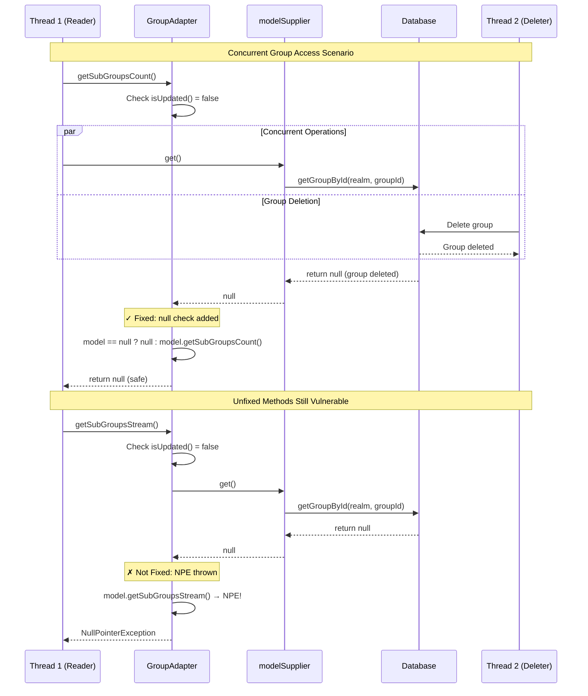

关键问题清单（按优先级排序）

1. GreptileComment
   - 风险级别: medium
   - 来源: 中置信（外部参考）
   - 位置: (位置未知)
   - 原因: <h3>Greptile Summary</h3>


This PR addresses a NullPointerException that occurs when groups are accessed concurrently during deletion. The fix adds null checking in `GroupAdapter.getSubGroupsCount()` to handle the race condition where `modelSupplier.get()` returns null after a group is deleted.

**Key Changes:**
- Added null check in `getSubGroupsCount()` to return null instead of throwing NPE when the underlying group model is deleted
- Added comprehensive concurrency test that creates 100 groups, then simultaneously deletes them while another thread reads the group list
- Removed unused `groupMatchesSearchOrIsPathElement()` helper method from `GroupUtils`
- Added missing `@Override` annotation in `CachedGroup`

**Critical Issue Found:**
The fix is incomplete. Three other methods (`getSubGroupsStream()` variants on lines 256, 262, and 268) still call `modelSupplier.get()` without null checks and will throw the same NPE in concurrent scenarios. These methods should apply the same null-safety pattern.

<h3>Confidence Score: 2/5</h3>


- This PR partially addresses the concurrent access NPE but leaves similar vulnerabilities unfixed
- The fix correctly addresses one method but three other methods with identical patterns remain vulnerable to the same NPE. The test may pass because it only triggers the fixed code path, not the unfixed ones
- `GroupAdapter.java` requires additional null checks in the three `getSubGroupsStream()` methods (lines 256, 262, 268)

<h3>Important Files Changed</h3>


| Filename | Overview |
|----------|----------|
| model/infinispan/src/main/java/org/keycloak/models/cache/infinispan/GroupAdapter.java | Added null check in `getSubGroupsCount()` to prevent NPE during concurrent access, but other methods calling `modelSupplier.get()` lack same protection |
| tests/base/src/test/java/org/keycloak/tests/admin/group/GroupTest.java | Added comprehensive concurrency test that creates, deletes, and reads groups simultaneously to verify NPE fix |

</details>


<h3>Sequence Diagram</h3>


   - 建议: 

2. GreptileComment
   - 风险级别: medium
   - 来源: 中置信（外部参考）
   - 位置: model/infinispan/src/main/java/org/keycloak/models/cache/infinispan/GroupAdapter.java:256
   - 原因: **logic:** These three `getSubGroupsStream()` methods can also throw NPE in the same concurrent scenario. If a group is deleted while another thread reads, `modelSupplier.get()` returns null.

```suggestion
    @Override
    public Stream<GroupModel> getSubGroupsStream(String search, Integer firstResult, Integer maxResults) {
        if (isUpdated()) return updated.getSubGroupsStream(search, firstResult, maxResults);
        GroupModel model = modelSupplier.get();
        return model == null ? Stream.empty() : model.getSubGroupsStream(search, firstResult, maxResults);
    }

    @Override
    public Stream<GroupModel> getSubGroupsStream(Integer firstResult, Integer maxResults) {
        if (isUpdated()) return updated.getSubGroupsStream(firstResult, maxResults);
        GroupModel model = modelSupplier.get();
        return model == null ? Stream.empty() : model.getSubGroupsStream(firstResult, maxResults);
    }

    @Override
    public Stream<GroupModel> getSubGroupsStream(String search, Boolean exact, Integer firstResult, Integer maxResults) {
        if (isUpdated()) return updated.getSubGroupsStream(search, exact, firstResult, maxResults);
        GroupModel model = modelSupplier.get();
        return model == null ? Stream.empty() : model.getSubGroupsStream(search, exact, firstResult, maxResults);
    }
```
   - 建议: 

3. 方法返回值可能为null，可能导致下游NPE
   - 风险级别: high
   - 来源: 低置信（仅本系统）
   - 位置: model/infinispan/src/main/java/org/keycloak/models/cache/infinispan/GroupAdapter.java:274
   - 原因: 在 `getSubGroupsCount` 方法中，当 `modelSupplier.get()` 返回 `null` 时，该方法现在会返回 `null`。这是一个重大的行为变更。调用此方法的代码可能期望返回一个 `Long` 数值（即使是0），并直接对其进行数值操作（如 `count.longValue()` 或算术运算），这将导致下游代码抛出 `NullPointerException`。
   - 建议: 建议返回一个默认值，例如 `0L`，而不是 `null`，以保持方法返回值的数值语义，从而保护调用方免受NPE的影响。如果返回 `null` 是预期的行为，则必须更新方法的JavaDoc文档，明确说明在特定条件下可能返回 `null`，以便调用者能够正确处理。

4. 并发测试存在时序依赖和资源管理问题
   - 风险级别: medium
   - 来源: 低置信（仅本系统）
   - 位置: tests/base/src/test/java/org/keycloak/tests/admin/group/GroupTest.java:130
   - 原因: 新增的并发测试 `createMultiDeleteMultiReadMulti` 存在几个问题：1. 它使用一个 `AtomicBoolean` 标志和忙等待（自旋锁）来同步线程，这会消耗不必要的CPU资源，并且测试的可靠性依赖于线程调度，可能导致测试不稳定。2. 创建的读取线程没有被 `join()`，这可能导致测试在主线程结束后，读取线程仍在运行，是一种不良的资源管理实践。
   - 建议: 建议使用 `java.util.concurrent.CountDownLatch` 来进行线程同步。主线程在删除完所有组后，调用 `latch.countDown()`，而读取线程在循环结束后调用 `latch.await()`。主线程应调用 `readerThread.join()` 来等待读取线程完全结束，确保测试的确定性和资源的正确释放。